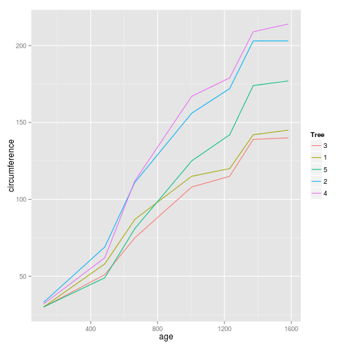

## RMarkdown allows you to make reproducible analyses

- Include 
  - Text 
  - Code
  - Code output

---
## Slidify lets you make slides in RMarkdown

- Slides will work the same across all operating systems and on the web
- If your data changes, just rebuild the presentation and your done!
- You can do really cool interactive plots and things 

---
## Easily include code

```r
library(ggplot2)
ggplot(data=Orange) + geom_line(aes(x=age, y=circumference, color=Tree))
```

 

---
## It's not just for R


```python
import numpy as np
print "Hello python"
```

```
## Hello python
```

--- &radio
## Interactive quiz widget
If `pwd` displays `/Users/backup`, and `-r` tells `ls` to display things in reverse order, what command will display:
```
pnas-sub/ pnas-final/ original/
```
1. ls pwd
2. ls -r -F
3. ls -r -F /Users/backup
4. _Either #2 or #3 above, but not #1_

*** .hint
This is a hint

*** .explanation
Since `/Users/backup` is an absolute path, it's okay to pass it to ls despite the fact that we're already there. It's unecessary, though.

--- 
## Interactive Chart


<div id = 'chart1' class = 'rChart nvd3'></div>
<script type='text/javascript'>
 $(document).ready(function(){
      drawchart1()
    });
    function drawchart1(){  
      var opts = {
 "dom": "chart1",
"width":    800,
"height":    400,
"x": "Hair",
"y": "Freq",
"group": "Eye",
"type": "multiBarChart",
"id": "chart1" 
},
        data = [
 {
 "Hair": "Black",
"Eye": "Brown",
"Sex": "Male",
"Freq":             32 
},
{
 "Hair": "Brown",
"Eye": "Brown",
"Sex": "Male",
"Freq":             53 
},
{
 "Hair": "Red",
"Eye": "Brown",
"Sex": "Male",
"Freq":             10 
},
{
 "Hair": "Blond",
"Eye": "Brown",
"Sex": "Male",
"Freq":              3 
},
{
 "Hair": "Black",
"Eye": "Blue",
"Sex": "Male",
"Freq":             11 
},
{
 "Hair": "Brown",
"Eye": "Blue",
"Sex": "Male",
"Freq":             50 
},
{
 "Hair": "Red",
"Eye": "Blue",
"Sex": "Male",
"Freq":             10 
},
{
 "Hair": "Blond",
"Eye": "Blue",
"Sex": "Male",
"Freq":             30 
},
{
 "Hair": "Black",
"Eye": "Hazel",
"Sex": "Male",
"Freq":             10 
},
{
 "Hair": "Brown",
"Eye": "Hazel",
"Sex": "Male",
"Freq":             25 
},
{
 "Hair": "Red",
"Eye": "Hazel",
"Sex": "Male",
"Freq":              7 
},
{
 "Hair": "Blond",
"Eye": "Hazel",
"Sex": "Male",
"Freq":              5 
},
{
 "Hair": "Black",
"Eye": "Green",
"Sex": "Male",
"Freq":              3 
},
{
 "Hair": "Brown",
"Eye": "Green",
"Sex": "Male",
"Freq":             15 
},
{
 "Hair": "Red",
"Eye": "Green",
"Sex": "Male",
"Freq":              7 
},
{
 "Hair": "Blond",
"Eye": "Green",
"Sex": "Male",
"Freq":              8 
} 
]
  
      if(!(opts.type==="pieChart" || opts.type==="sparklinePlus" || opts.type==="bulletChart")) {
        var data = d3.nest()
          .key(function(d){
            //return opts.group === undefined ? 'main' : d[opts.group]
            //instead of main would think a better default is opts.x
            return opts.group === undefined ? opts.y : d[opts.group];
          })
          .entries(data);
      }
      
      if (opts.disabled != undefined){
        data.map(function(d, i){
          d.disabled = opts.disabled[i]
        })
      }
      
      nv.addGraph(function() {
        var chart = nv.models[opts.type]()
          .width(opts.width)
          .height(opts.height)
          
        if (opts.type != "bulletChart"){
          chart
            .x(function(d) { return d[opts.x] })
            .y(function(d) { return d[opts.y] })
        }
          
         
        
          
        

        
        
        
      
       d3.select("#" + opts.id)
        .append('svg')
        .datum(data)
        .transition().duration(500)
        .call(chart);

       nv.utils.windowResize(chart.update);
       return chart;
      });
    };
</script>
---
## How can you do this?

First, install slidify


```r
require(devtools)
install_github("ramnathv/slidify", "dev") #Slidify isn't on CRAN, the normal R package manager, so we have to get it directly from Github. Sometimes this doesn't go as smoothly on Windows, but don't worry, the internet can help!
install_github("ramnathv/slidifyLibraries", "dev")
library(slidify)
```
